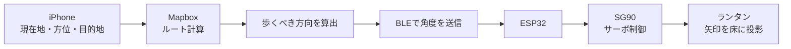

# みちあかり

地図を見るために立ち止まるのではなく、光をたどりながら歩く。

みちあかりは、ランタンの光で進む方向を知らせるアプリとデバイスです。目的地を選ぶと、足元に浮かぶ矢印が次に歩く方向を示します。

ランタンを手に夜道を歩く、そんな夏らしい素敵な体験を目指しました。

<!-- デモ動画を追加する場合は、docs/demo.gif を置いて次の行を有効にしてください。 -->
<!--  -->

## 何が新しいか

一般的なナビゲーションは、スマホ画面の地図を見ることで道を確認します。みちあかりは、進むべき方向を足元の光として表示します。

目的地をまっすぐ指すのではなく、Mapboxで計算したルートに沿って、歩くべき道を示します。そのため曲暗い中、初めての場所でも自然に進む方向がわかります。

## 使い方

iPhoneでアプリを開き、地図上の向かいたい場所をタップします。するとランタンの光が矢印となり、進む方向を示します。目的地をもう一度タップすると案内削除できます。

## 作成背景

近年の暑さから、昼だけでなく夜を楽しむイベントや散歩の価値が高まっています。

そこでランタンを手に夜道を歩きながら、光に導かれて進むような体験をつくりたいと考えました。スマホの画面ではなく、足元に浮かぶ矢印をたどることで、普段の道歩きを少し特別な時間に変えることを目指しています。

## システム構成

## 仕組み

iOSアプリ上で目的地をタップするとMapboxDirectionsAPIによって、現在位置から目的地までのルートを計算します。
目的地の直線方向ではなく、ユーザーが歩くべきルートに沿う方向を計算し、画面左上の矢印を回転させます。その情報をBLEでESP32へ送信し、受け取ったESP32がサーボモーターを回転させます。

これにより、道に浮かぶ矢印で案内します。

## 使用技術

- Flutter/Dart
- MapboxMapsSDK/Directions API
- BLE通信
- ESP32(マイコン)
- SG90(サーボモーター)
- Fusion
- 3Dプリンター

## ハードウェア構成

- ランタン: 和紙と竹ひごで作成
- 投影: 矢印模様のスリットに光を当て、レンズを通して床に投影
- 矢印の回転: 目的地の方向ではなく、歩くべきルート方向を示す
- SG90: 投影機構の回転
- ESP32: スマホとのBLE通信とモーター制御
- 軸・ブラケット: Fusionで設計し、3Dプリンターで印刷

ESP32側のスケッチは `esp32/navigation_lantern_ble_servo.ino` 

## 今後の改善

- バッテリーを1系統にまとめ、持ち運びやすくする
- 回路を小型化して、ランタン内部に自然に収める
- ライトの点灯時間を長くする
- アプリを閉じても案内を継続できるようにする
- 実際の夜道やイベント会場で利用する
